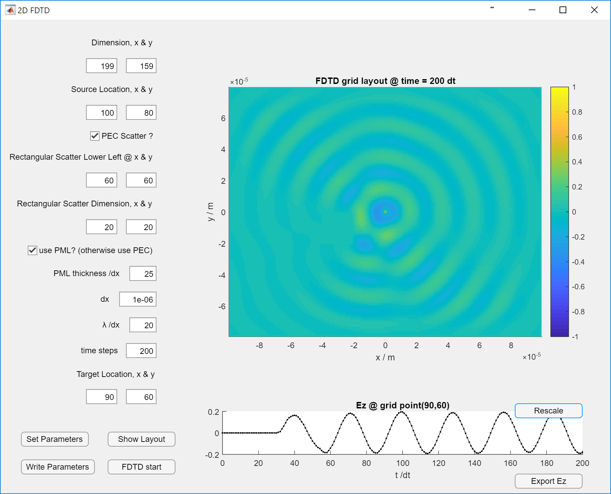

# Project 1, 2D-FDTD, TMz mode

This GUI is created by App Designer in MATLAB 2017a. 

It can output the `config.bin`. Currently the button `FDTD start` is just: read `output.bin` and display it. 

To run the GUI, you can type `appdesigner` in MATLAB command line. Then open `GUI_2D_FDTD.mlapp` in the pop-up App Designer. 

When running the GUI, make sure **the current path is where the `.mlapp` file lives**.

Here is an image of this GUI.

